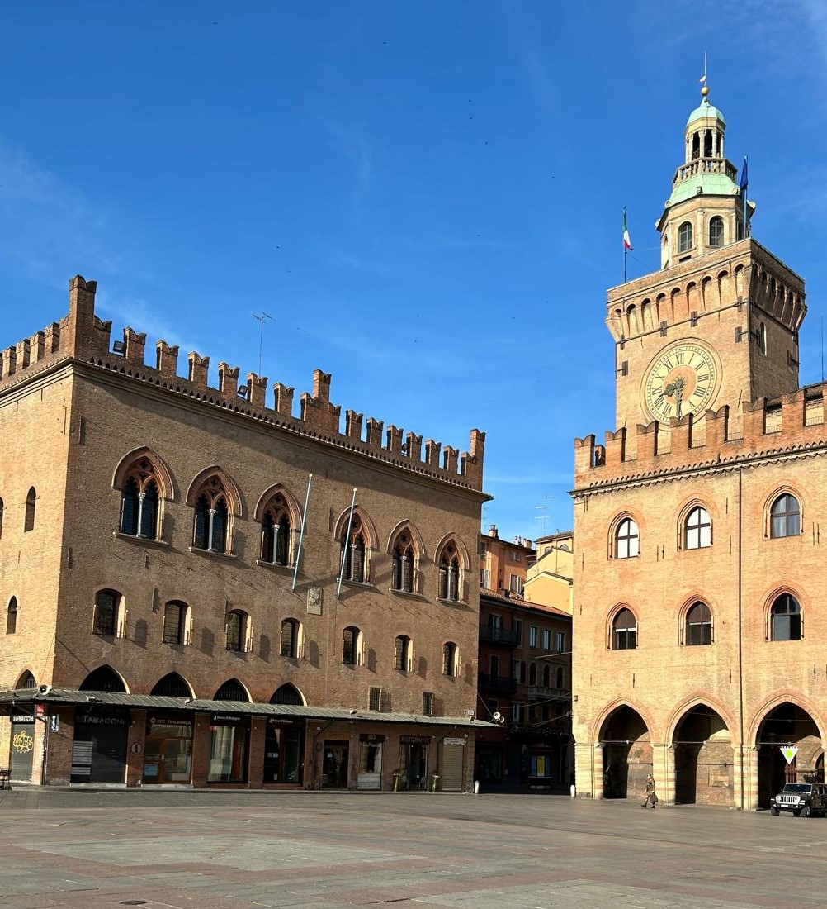

# Applying AI/GenAI in Design and Process Science (GenAI4DPS) 2024 

The 26th International Conference of the [Society of Design and Process Science (SDPS)](https://www.sdpsnet.org/sdps/) on Advances and Challenges of Applying AI/GenAI in Design and Process Science [GenAI4DPS 2024](https://genai4dps.github.io/advances-challenges) is going to be held on October 6-9, Bologna, Italy. 

SDPS has been at the forefront of transdisciplinary research and transformative science and engineering for almost 30 years.  Our international events are forums for challenging  advances in process and design science, computing and software technologies and their impact on research and education.  We are delighted to be back to Bologna, known for their old University and a very vibrant science and research communities.  This is an opportunity to address the main motto of SDPS 2023 conference and debate an inevitable impact of AI/GenAI to research, academia and businesses.

[GenAI4DPS 2024](https://genai4dps.github.io/advances-challenges) focuses on the impact of AI and GenAI on the design and process of applications now and beyond. It is funded by , the forefront of interdisciplinary and transdisciplinary research for over 28 years. 

## Credits

Webpage project based on the [alshedivat/al-folio](https://github.com/alshedivat/al-folio) template.
Workshop webpage powered by [Jekyll](https://jekyllrb.com/) and hosted by [GitHub page](https://pages.github.com).

